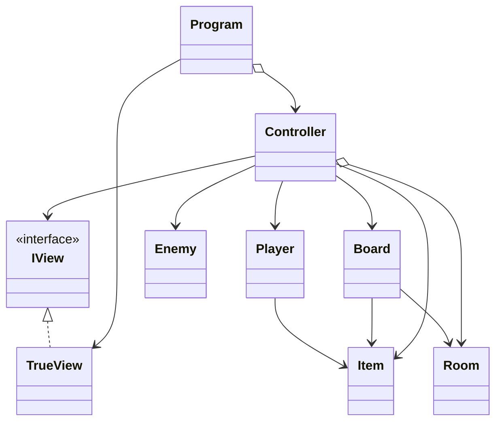

# Yet Another Dungeon Crawler
#### By Bruno Alegria a22302942, Ivan Emídio a22301234, Fábio Ribeiro a22102432
##### Linguagens de Programação I - Projeto 2
[Project's Git link](https://github.com/BrunoSilvaAlegria/LP1-Project-2.git)

### Bruno Alegria
+ Creator of the git repository
+ Main responsible for the README.md file
+ Dungeon Map creator
+ UML diagram creator
+ View classes main responsible
+ Controller class responsible

### Ivan Emídio
+ Controller class main responsible
+ Model classes main responsible
+ View classes responsible

### Fábio Ribeiro
+ XML Documentation main responsible
---
## The Dungeon's Map

---
## Architecture

### Project's Organization and non-trivial Algorithms

#### Our project is organized around eight classes, one interface and a text file: 

##### **Classes**: Program, Controller, TrueView, Board, Player, Enemy, Item and Room
  * **Program**: Makes the game start with the file path given, that is supposed to lead to the text file contaning the rooms description.
  * **Controller**: Basically what *controls* the game in the sense that connects everything. It has the main methods (not writing/reading) of the project, like the StartGame method that makes the game follow the player decisions by receiving its actions. In addition, this class contains the action methods, such as MovePlayer, SearchRoom, UseItem and Attack, with each of them calling their corresponding write/read methods (located in IView and TrueView).
  * **TrueView**: Its the *true* and hidden appearance of all that appears on screen, from the *fancy* main menu to the single line that represents the end of the game. All of the methods in here are inherited from IView and used to write something on the screen and/or read the player's inputs.
  * **Board**: Creates the game's map itself, a 3x3 map with individual rooms (with the type Room). The rooms description file is read in here, and used to create each room according to its individual description.
  * **Player**: Contains all the relevant information about the player, like Health and AttackPower (that are, in this case, properties) but also its inventory (a list) where the player can store items and later use them. All the items the player founds are transformed into Health Potions.
  * **Enemy**: Contains all the relevant information about the only existing enemy, like Health and AttackPower (properties).
  * **Item**: Contains the constructor that allows an item to be created, requiring a name and a value (in this case for healing, due to the only item present in the game is a Health Potion).
  * **Room**: This class represents each individual room, but in a general way. It has properties for the room's coordinates, exits, enemies and items, as well as two methods: RemoveEnemy and RemoveItem. They're similar in the way that they remove something from the room, with the first one removing an enemy when defeated, and the second one removing an item when collected.

##### **Interface**: IView
  * **IView**: Contains all methods described in the TrueView class, but simplified. Basically, only calls them.
    
##### **Text File**: rooms.txt
  * **rooms.txt**: Contains the rooms descriptions, with its XY coordinates, exits available, and if it has an enemy and/or an item, in this order. The last three are represented by 0 and 1, with 0 being false and 1 being true, while the XY coordinates go from 0 to 2, in a grid format. For example, the player starts in the middle of the map, so the room he's in has the coordinates (1,1).

### UML Diagram

LP1 Project II Diagram | Bruno Alegria | Ivan Emídio | Fábio Ribeiro
 

---
## References

#### Ideas

Bruno - Use IView interface to organize the writing and reading methods described in TrueView class, and use them on the Controller class (following the MVC format).
Bruno - Have all the main action methods in Controller.
Bruno - Make the rooms description in a separated text file located in the same directory of the rest of the classes, so it is easy to access and use.
Bruno - In Board, read the rooms description file, line by line, and construct the rooms accordingly.


#### AI Code
* Chat GPT
  * in c#, how to reference a specific text file to use as a path?
       ```
    Absolute Path:
       string filePath = @"C:\Users\YourUsername\Documents\rooms.txt";

    Relative Path:
       string filePath = @"rooms.txt"; or string filePath = @"Data\rooms.txt"; (It depends on where the program is running and where the text file is, regarding the executable).
       ```
  * how to relate the information on a text file to variables?
       ```
       Define the User Class:
       
         public class User
         {
             public string FirstName { get; set; }
             public string LastName { get; set; }
             public int Age { get; set; }
             public string Email { get; set; }
         
             public User(string firstName, string lastName, int age, string email)
             {
                 FirstName = firstName;
                 LastName = lastName;
                 Age = age;
                 Email = email;
             }
         
             public override string ToString()
             {
                 return $"{FirstName} {LastName}, Age: {Age}, Email: {Email}";
             }
         }

       Read and Parse the File:

         using System;
         using System.Collections.Generic;
         using System.IO;
         
         namespace FileReadingExample
         {
             class Program
             {
                 static void Main(string[] args)
                 {
                     string filePath = "users.txt"; // Ensure this path is correct
         
                     // Check if the file exists
                     if (!File.Exists(filePath))
                     {
                         Console.WriteLine("File not found.");
                         return;
                     }
         
                     // Read and parse the file
                     List<User> users = new List<User>();
                     string[] lines = File.ReadAllLines(filePath);
         
                     foreach (string line in lines)
                     {
                         // Split the line into parts
                         string[] parts = line.Split(',');
         
                         if (parts.Length == 4)
                         {
                             string firstName = parts[0];
                             string lastName = parts[1];
                             int age = int.Parse(parts[2]);
                             string email = parts[3];
         
                             // Create a new User object and add it to the list
                             User user = new User(firstName, lastName, age, email);
                             users.Add(user);
                         }
                     }
         
                     // Output the parsed users
                     foreach (User user in users)
                     {
                         Console.WriteLine(user);
                     }
                 }
             }
         }
       ```

#### Open Code
* [Stack Overflow, How to create a list of methods](https://stackoverflow.com/questions/23437970/how-to-create-a-list-of-methods-then-execute-them) 
#### Libraries
* [The MVC Code Architecture and How to Implement It](https://www.dio.me/articles/arquitetura-mvc-no-c)
* [Mermaid diagram on draw.io](https://www.drawio.com/blog/mermaid-diagrams)
* [How to add a .png file to Github with git lfs](https://josh-ops.com/posts/add-files-to-git-lfs/)
* [Methods for Lists in C#](https://learn.microsoft.com/pt-pt/dotnet/csharp/tour-of-csharp/tutorials/arrays-and-collections)
