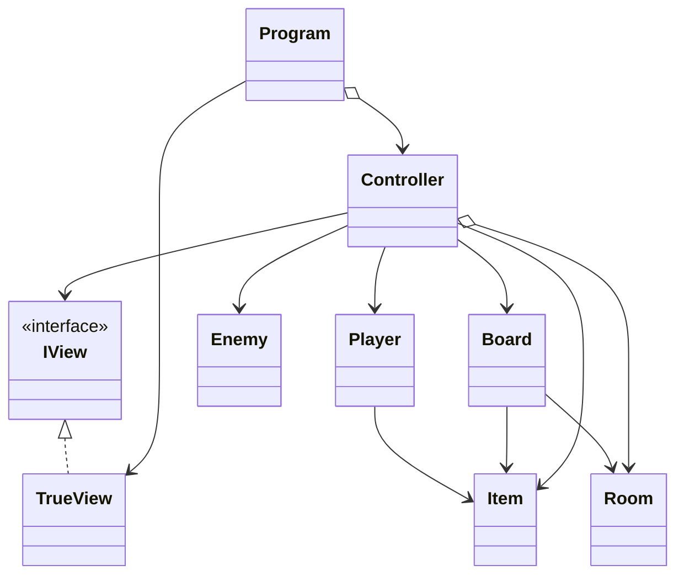

# Yet Another Dungeon Crawler
#### By Bruno Alegria a22302942, Ivan Emídio a22301234, Fábio Ribeiro a22102432
##### Linguagens de Programação I - Projeto 2
[Project's Git link](https://github.com/BrunoSilvaAlegria/LP1-Project-2.git)

### Bruno Alegria
+ Creator of the git repository
+ Main responsible for the README.md file
+ UML diagram creator
+ View classes main responsible
+ Controller class responsible

### Ivan Emídio
+ Board class main responsible
+ Controller class main responsible

### Fábio Ribeiro
+ XML Documentation main responsible
---
## The Dungeon's Map

---
## Architecture

#### Project's Organization and non-trivial Algorithms

#### UML Diagram

LP1 Project II Diagram | Bruno Alegria | Ivan Emídio | Fábio Ribeiro
 

---
## References

#### Ideas

Bruno - Use IView interface to organize the writing and reading methods described in TrueView class, and use them on the Controller class (following the MVC format).

#### AI Code

#### Open Code

#### Libraries
* [Mermaid diagram on draw.io](https://www.drawio.com/blog/mermaid-diagrams)
* [How to add a .png file to Github with git lfs](https://josh-ops.com/posts/add-files-to-git-lfs/)

